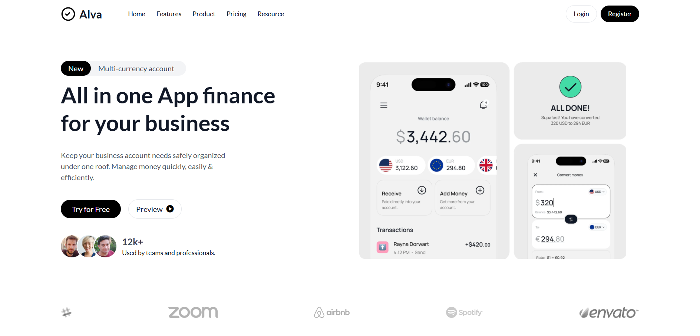

# Alva Hero Section

This is a responsive **hero section** built using **HTML5** and **Tailwind CSS**, inspired by a UI design originally found on **Dribbble**. The section showcases modern design principles including rounded buttons, avatar groups, announcement banners, and responsive layout.

---

## ✨ Features

- Clean and modern UI
- Responsive layout using Tailwind utility classes
- "New / Multi-currency account" toggle-styled button
- Announcement banner with dismiss button
- Primary call-to-action (CTA) and secondary preview button
- Avatar group to show team engagement
- Background image area styled to match Dribbble inspiration

---

## 📸 Preview



> 🔎 Based on a concept spotted on [Dribbble]([https://dribbble.com](https://dribbble.com/shots/24832880-Financial-Payment-Landing-Hero-Section))
---

## 🛠 Technologies Used

- HTML5
- Tailwind CSS
- Google Fonts (`Lato`)
- Font Awesome (for icons)

---

## 🚀 Getting Started

To run this project locally:

1. Clone the repository:

```bash
git clone https://github.com/yourusername/your-repo-name.git
cd your-repo-name
